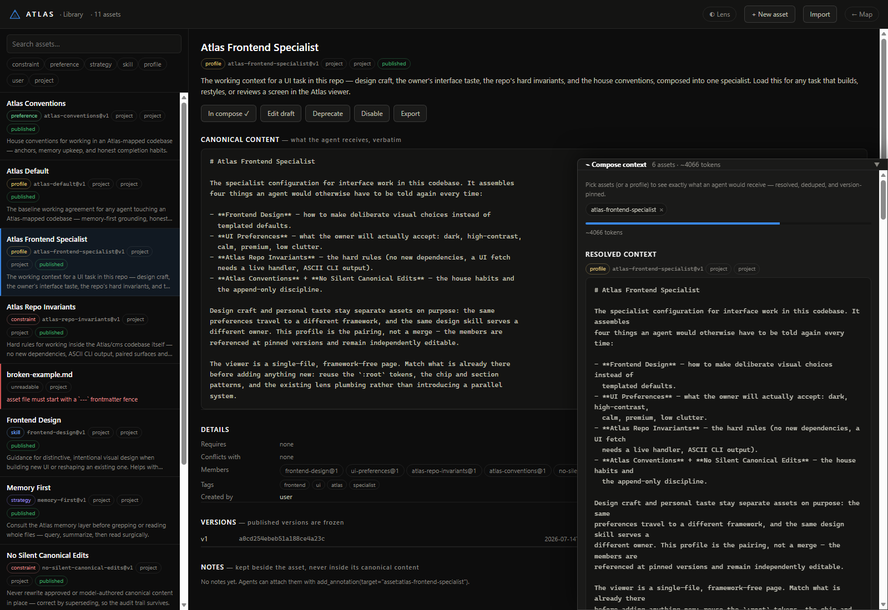

<h1>▲ Atlas</h1>

[](https://github.com/mrt150683-lgtm/atlas-cms/actions/workflows/ci.yml)

**Every codebase, mapped. One ground truth that AI agents and people read the same way.**

*(Atlas is the product; `cms` is the command line and Python package: `pip install`, `cms run-all`, `cms mcp`.)*

## Why I built Atlas

I built Atlas after seeing the same problem again and again: AI agents can be
very good at writing code, but every new task begins with an incomplete picture
of the codebase. They search for fragments, read large files, burn through
context, miss important connections, and can confidently say a change is
finished without proving that it fits what the project was meant to do.

As codebases and agents become more capable, I do not think the answer is simply
giving them a larger context window. Agents need a living map of the project:
its structure, relationships, intent, decisions, and evidence, kept current as
the code changes. The people working with those agents also need to see what
they see, correct what they misunderstand, and know where their claims came
from.

That is how I see Atlas helping. It gives every agent shared, inspectable ground
truth before it touches the code, then checks the result against the original
intent afterward. That means less time rediscovering a project, fewer
hallucinated assumptions and accidental knock-on changes, faster onboarding,
and more continuity between agents and sessions. Most importantly, it gives us
a credible answer to: **"Did this change actually do what we meant it to do?"**

**I did not build Atlas to help AI write more code. I built it to help AI
understand the code it changes, and to help people trust the result.**


---

## What Atlas does

Atlas is a self-bootstrapping structural + semantic memory layer for codebases,
built for AI agents and the people who work with them. It scans a project
(ignoring junk like `node_modules/`, `__pycache__/`, build output), parses the
source into a knowledge graph of files, classes, and functions, generates
low-resolution AI summaries for each, and exposes a query interface so an agent
can ask *"where is the auth logic?"* and get precise answers: file paths, line
ranges, call connections, and intent summaries, instead of grepping.

Beyond finding things, Atlas **keeps the codebase honest**. It traces features,
audits built-vs-intended alignment, runs a completion quality gate (Hermes
Sentinel), and, with the Change-Alignment loop, answers *"did this change do
what it was meant to?"* Agents consult memory before grep, ground every edit,
and prove they finished.

Full design rationale: [`codebase_memory_system_design_spec.md`](codebase_memory_system_design_spec.md).
Project credits and contribution provenance: [`CONTRIBUTORS.md`](CONTRIBUTORS.md).
License: [AGPL-3.0](LICENSE). Free to use and study; ship it (or host it) modified and your changes must be open too.

## One map, every reader

The core idea behind Atlas's newest layer: **the model and the human look at
the same canonical map, never at two different stories.**

There is exactly one knowledge graph. AI agents read it at full fidelity
through the MCP tools (the *AI View*: every node, every edge, every piece of
evidence). Humans read the very same graph through two independent dials in
the viewer, so anyone, from a project owner who has never programmed to the
specialist who wrote the code, sees what the agent sees at the depth and in
the language that fits them:

- **The resolution slider (Human View)** controls *how much structure* is
  shown. Six notches walk the semantic pyramid: System, Component, Feature,
  Module, Function, Source. The big-picture end shows the whole codebase as a
  handful of named systems; the far end opens the annotated raw source. Every
  level is a projection of the same canonical nodes, and a clickable
  breadcrumb trail maps any selection up and down the pyramid, so a feature
  you click at the "big picture" level traces down to the exact functions the
  agent reasons about.
- **The comprehension lens** controls *how things are worded*. The same facts
  can be re-explained for a schoolchild, a technician, a university student,
  a domain specialist, as a one-line TL;DR, or as short focus-friendly
  bullets. Rewrites keep every fact and identifier and never touch the stored
  data.

The two dials compose: a non-technical stakeholder can set the map to
"Component" and the lens to "schoolchild" and still be looking at the exact
same ground truth the agent uses, traceable node for node. Annotations,
approved decisions, flow verdicts, and evidence chips attach to canonical
objects, so a note written at any level follows the object across every level,
whether a human or a model wrote it. Nobody works from a private picture, and
nothing shown to the human is ever simplified away from the model.

## Install

```bash
pip install -e .            # core (networkx, pathspec, typer)
pip install -e ".[anthropic]"  # + Anthropic SDK for LLM summaries
```

## Usage

```bash
cms run-all                 # scan -> graph -> summaries -> features -> git -> .memory/
cms query "where is the ignore pattern filtering logic?"
cms ui                      # open the memory viewer in your browser
cms update                  # incremental: only changed files re-summarized
cms watch                   # keep .memory/ in sync as you edit
cms impact cms/scanner.py::scan   # blast radius of a change
cms drift [--json]          # gate on stale @memory summaries and unsupported feature links
cms verify                  # map tests to features via coverage
cms verify CleanDirectoryScanner  # run exactly the tests mapped as exercising a feature
cms verify --refresh               # force fresh per-test coverage instead of using a current cache
cms flow CleanDirectoryScanner    # exact-flow review: evidence-classified execution account
cms mcp                     # MCP server for AI agents (see below)
cms sentinel                # Hermes Sentinel: bug finding + completion quality gate
cms fuse                    # Constellation: cross-project integration/conflict report
cms scout scan ~/Desktop    # hunt plan.md docs, card them, mass-review for ideas/patterns
# Brainstorm (Discovery UI tab): temp-adjusted new-concept generation that
# learns from your likes/dislikes; standing goals via a hidden panel
cms scan                    # just the clean tree (subset of run-all)
cms build-graph             # scan + knowledge graph only
cms summarize               # (re)generate AI summaries only
cms prompt "add rate limiting"    # export a memory-grounded task brief
cms library list             # the Library: reusable, versioned agent-context assets
cms ideas capture "A useful thought" -o "Overview, notes, or a rough sketch"
cms ideas list "memory"      # search the durable journal shared by every Atlas project
cms ideas generate "missing agent tools" --mode cross_project --surprise 0.6
cms align --scan             # compare the current diff with captured/inferred intent and refresh Sentinel
cms scope show               # show which paths Atlas is currently processing
cms bundle export --out atlas.cmsbundle  # share the generated memory without re-processing
```

Change alignment distinguishes requirements from context: paths written
literally in the goal are mandatory, while semantic search hits and blast-radius
files are advisory. Requested docs, CI, dependency/security policy, UI
companions, tests, and generated proof artifacts are accepted only when the
declared goal justifies them; unrelated changes still surface as scope creep.

## App mode (`cms app` / CMS.exe)

Everything in motion with one command, or one double-click:

```bash
cms app        # sync memory -> start file watcher -> serve UI -> open browser
cms            # no arguments does the same thing
```

On launch it heals any stale memory (only changed / mock-summarized files are
reprocessed), then watches for edits and keeps `.memory/` current while the UI
runs. Ctrl+C stops everything.

### Running from source (`CMS.bat`)

On machines where an unsigned exe is unwelcome (AV quarantine), `CMS.bat` is
the equivalent launcher: it runs `python -m cms.cli` from the repo's `.venv`
(falling back to the `python` on PATH), passes arguments through, and returns
the real exit code. Double-click for the app, or `CMS.bat query "..."` etc.

### Packaging as CMS.exe

```bash
pip install pyinstaller
python -m PyInstaller --onefile --name CMS --console --clean --noconfirm ^
    --add-data "cms/ui_assets/index.html;cms/ui_assets" --hidden-import anthropic ^
    --exclude-module torch --exclude-module torchvision --exclude-module torchaudio ^
    --exclude-module numpy --exclude-module scipy --exclude-module pandas ^
    --exclude-module matplotlib --exclude-module cv2 --exclude-module PIL ^
    --exclude-module lxml --exclude-module IPython --exclude-module jupyter ^
    --exclude-module pytest --exclude-module coverage --exclude-module rich ^
    --exclude-module pygments --exclude-module tkinter --exclude-module setuptools ^
    cms_exe.py
```

The excludes matter: networkx probes for optional backends (numpy/scipy/pandas/
matplotlib) at import time, so PyInstaller happily bundles whatever heavy
packages live in your site-packages (a torch install alone adds ~400 MB).
CMS uses none of them.

**Installer-style first run:** double-click `CMS.exe` anywhere and it asks which
codebase this copy should work on, then saves the choice to `cms.workspace.json`
next to the exe. Every launch after that goes straight to that project, so you
can keep one copy of CMS.exe per codebase, each linked to its own root. Delete
`cms.workspace.json` (or pass `--root`) to re-link. If the exe sits inside a
project root already, that project is used directly with no prompt.

All CLI commands work through the exe too (`CMS.exe query "..."`,
`CMS.exe impact ...`). The API key is read from `~/.cms/config.json` as usual.
Note: `CMS.exe verify` shells out to your installed Python for pytest/coverage.

## MCP server (`cms mcp`)

Expose the memory to AI agents as native tools, so memory is consulted before grep:

```bash
claude mcp add cms -- cms mcp        # Claude Code
codex mcp add cms -- cms mcp         # Codex
```

No `--root` needed: the server walks up from its launch directory to the
nearest project holding `.memory/graph.json`, so one global entry serves every
repo. In an un-mapped repo it stays alive and tools answer "no memory layer:
run `cms run-all`".

37 tools (this list is contract-checked against `cms/mcp.py` by Sentinel):

- **Grounding / read**: `query_codebase`, `get_file_summary`, `get_source`,
  `get_feature_trace`, `list_features`, `who_calls`, `who_imports`, `get_impact`.
- **Discuss**: `ask_codebase`, plain-language Q&A over the whole memory
  (flows, features, connections, intent-vs-reality), evidence named. Also in
  the UI as the Ask Atlas chat popup and on the CLI as `cms ask "..."`.
- **Judgment / plan**: `get_review`, `get_suggestions`, `get_sentinel_report`,
  `get_anchor_drift`, `export_task_prompt`. Anchor Drift is deterministic and
  compares each human-authored summary/link with current source and graph evidence.
- **Alignment loop**: `declare_intent`, `check_alignment`.
- **Annotations**: `add_annotation`, `list_annotations`. Typed, lifecycled
  annotations on canonical graph objects (features, files, functions, edges,
  source ranges) with author provenance; model-authored entries are immutable
  and corrected by supersession.
- **Decisions**: `propose_decision`, `get_decisions`. Versioned
  intended-behaviour statements. Approval is human-only (the UI asks for a
  per-session code printed only to the launching terminal for both approval
  and closure/rejection) and locks the intent; changing an approved decision
  means superseding its current approved predecessor in the same feature
  scope (cross-feature and stale links are refused), so the agreed word is
  never silently rewritten, shadowed, or attached to the wrong audit chain.
- **Library**: `list_assets`, `get_asset`, `propose_asset`, `record_asset_use`,
  `get_asset_feedback`. Select reusable context, keep publishing human-only, and
  learn from exact-version outcomes without mixing agent confidence with user ratings.
- **Project Idea**: `search_ideas`, `get_idea`, `get_idea_map`, `propose_idea`,
  `generate_idea_candidates`, `join_idea_dots`. The published `project-idea`
  Library skill gives agents the full workflow: recall canonical journal history,
  inspect project/feature combinations, and add model suggestions to a human review
  inbox without silently rewriting accepted thought.
- **Flow verification**: `review_exact_flow`. Evidence-classified execution
  flows (static edges + step-granular coverage + bounded source reads);
  `verified` is computed from evidence (every in-feature step's own lines
  must be exercised), never asserted by the model, and every status carries
  its scope (flows/steps reviewed vs traced). `proven` is reserved for
  AST-exact facts; heuristic call edges read `static`. Also on the CLI as
  `cms flow <Feature>`.
- **Feature discovery**: `discover_feature`, the feature hunt. Describe a
  behaviour the automatic mapping may have missed and Atlas checks whether it
  is already stated (deterministic overlap against the complete feature
  catalog), hunts the graph with one-hop neighbourhood expansion, validates
  every proposed member and connection, reconciles the verdict against the
  surviving evidence, and keeps only mechanism steps whose backticked code
  references resolve to prompt evidence. Verdicts: already_covered,
  partial_overlap, new, not_found. Humans confirm in the UI.
- **Library**: `list_assets`, `get_asset`, `propose_asset`. Reusable, versioned
  agent-context assets (skills, strategies, preferences, constraints, profiles).
  Agents browse and load them, and may propose new ones or revisions as
  **drafts** — provenance-stamped agent-authored, invisible to any agent's
  context until a human publishes them. There is deliberately no publish tool:
  publishing, like decision approval, is human-only. `export_task_prompt` and
  `declare_intent` take an `assets` selection and record the exact versions
  used. See [The Library](#the-library-cms-library).
- **Session control**: `switch_project` (flip the server to another project
  root mid-session; unmapped targets get the exact build command back).
- **Constellation**: `list_projects`, `get_fusion_report`, `refine_fusion`.
  Multi-project discovery: read and conversationally refine the
  cross-codebase fusion report (see `cms fuse`).

Every call is logged to `.memory/activity.jsonl`, and the UI renders live glow
pulses on the touched nodes plus an `MCP · tool` badge, so you can watch your
agent think.

## Git history layer

Inside a git repo, `run-all`/`update` enrich file nodes with commits, authors,
churn and age, and detect **hidden coupling**: file pairs that repeatedly change
together without any import relationship (CO_CHANGES edges). In the UI, hit
`heat` and nodes recolor by change frequency (calm to hot), co-change pairs draw
as dashed amber links, and the inspector gains a History section.

## Verification loop

`cms verify` runs your tests under coverage with per-test contexts and maps each
feature to the tests that actually execute its code (`exercised_by`, named
deliberately: coverage proves execution, not behavioural correctness). The
mapping is honest at two granularities: it also lands on each individual
function and class, and a file's import-time lines never count as evidence;
componentless files contribute no behavioural coverage rather than falling
back to whole-file matching.
Then `cms verify <Feature>` runs exactly those tests, turning the feature
trace's checklist into runnable evidence.

## Feature tracing (`cms trace`)

Features are first-class: declare them with `@memory:feature:Name` anchors (the
LLM also discovers undeclared ones from file summaries). For every feature CMS
computes its members, entry points, and *flows*: call chains walked through the
graph with `file:line` at each step. It then writes a trace with Purpose, Flow,
Inputs & Outputs, and a **Verification Checklist** of concrete checks to confirm
the implementation does what you intended.

```bash
cms trace                    # build/refresh all feature traces
cms features                 # list features with member/entry counts
cms trace CleanDirectoryScanner   # print one trace
```

Traces live in `.memory/features/*.md`, in the graph (`feature:` nodes, so
`cms query` finds them), and in the UI: pick a feature in the explorer to see
its flow rail and light up its member files on the graph.

Features connect to each other two ways: **declared** links from `@memory:connects:`
anchors, and **inferred** RELATES edges derived from the code (a member of one
feature imports or calls a member of another), so even LLM-discovered features
join the web. Hit the `feat` button in the UI (or open `?view=features`) for the
feature-level architecture map: amber nodes are declared features, green are
discovered, solid edges declared, dashed inferred. Click any node for its trace.

## AI review (`cms review`)

The alignment audit: for every feature the AI compares what you *expect* (the
declared intent) against what was actually *built* (traced flows, member
summaries, mapped exercising tests) and hands down a verdict, **aligned /
partial / drift / unverified**, with a one-line plain-English headline, an
expected-vs-built explanation, concrete gaps, and an education note teaching
you how it really works under the hood. Plus an app-level rollup.

Reusable Atlas Library and imported skill-tree features remain searchable in
the graph, but are excluded from the core application verdict and its
product-feature hash. Updating reference material therefore does not make the
product review stale.

```bash
cms review                    # build/refresh the full review
cms review CleanDirectoryScanner   # print one feature's review
```

Results live in `.memory/review.md`, on the graph (agents get them via the
`get_review` MCP tool), and in the UI: hit the `review` button (or `?review=1`)
for the overlay, one line per feature, expand for detail, "zoom into this
feature on the map" for the full evidence.

Real-provider reviews are atomic. Every feature response and the app rollup
must pass the declared JSON contract before Atlas records semantic completion.
Connection errors, truncated/malformed replies, or mixed semantic/structural
output make the command fail non-zero, record the provider error, and preserve
the last complete review instead of presenting an incomplete run as `partial`.

## Suggestions (`cms suggest`)

CMS plans what's worth building next. It studies its own memory (review
verdicts and gaps, features with no mapped exercising tests, git churn
hotspots, hidden coupling) and proposes suggestions each scored **value (1–5)
vs effort (1–5)**, ranked by **ROI = value/effort**, highest return on
investment first.

The planning evidence follows the same boundary: Library/reference-only
features, hotspots, and hidden couplings do not become product work items.

```bash
cms suggest          # ranked plan -> terminal + .memory/suggestions.md
```

Suggestions also appear in the review overlay ("Suggested next") and are served
to agents via the `get_suggestions` MCP tool, so your AI can pick its own next
task by ROI.

## Memory viewer (`cms ui`)

A local, zero-dependency web UI over the memory layer at `http://127.0.0.1:7717`.
This is where the "one map, every reader" idea lives: the same canonical graph
the agents query, rendered for humans at whatever depth and wording fits them.

- **Explorer**: clean file tree, junk-free, colored by top-level directory.
- **Knowledge graph**: force-directed canvas; node size = lines, edges = imports.
  Hover for a summary tooltip, click to inspect, drag/pan/zoom, `ext` toggles
  external modules, `fit` reframes.
- **Inspector**: file stats, anchor chips, the AI summary, every component with
  line ranges, caller/callee counts and expandable source snippets, plus
  imports/imported-by navigation.
- **Search**: press `/` and ask in plain language; results rank via the same
  intent engine as `cms query`.
- **Human View**: the ◉ Human view toggle renders the same canonical graph at
  an adjustable abstraction level. Its 6-notch resolution slider walks the
  semantic pyramid (System, Component, Feature, Module, Function, Source), from
  whole-architecture shapes at the top to the annotated raw source at the
  bottom. System/component nodes are derived once per feature-set change (one
  LLM call; labelled structural grouping without a key), selections map
  between levels via a clickable breadcrumb trail, and double-click descends
  one level. **`←` / `→` step the resolution** from anywhere on the map (left =
  broader, right = deeper; the first press turns Human View on), which is the
  fastest way to walk the pyramid. The AI View (toggle off) always keeps full fidelity: resolution
  never touches the stored graph, so agents never lose detail because a human
  simplified their screen. Cached per-node explanations
  (`.memory/explain.json`) invalidate dependency-aware: a file change refreshes
  only that file's, its feature's and its ancestors' explanations.
- **Comprehension lens**: the ◐ Lens slider re-explains every summary, feature,
  review and suggestion for a chosen audience: schoolchild, technician, uni
  student, specialist, TL;DR (one bold sentence) or ADHD/low focus (short
  bullets); Default shows the raw data. Rewrites are LLM-generated on demand,
  cached per text+level in `.memory/lens/`, and never alter the stored data.
  TL;DR/ADHD degrade to built-in shortening without an API key. The lens
  composes with Human View, so any reader meets the same facts at their own
  level.
- **Annotations**: every inspector has an Annotations panel with typed,
  lifecycled notes on canonical objects (features, files, functions, systems).
  Model entries are visually distinct and immutable (superseded, never
  rewritten). Viewer quote-notes are merged into the same read surface, so
  humans and models annotate the same objects and read one shared record.
- **Intent & verification**: feature inspectors show the decision trail
  (propose, human approve, locked), an evidence-backed intent-fidelity
  dimension table, and the **Exact flow** panel (`cms flow <Feature>` on the
  CLI): evidence-classified execution steps with a computed verification
  status that never claims more than the evidence supports.
- **Describe a feature (the hunt)**: the "＋ Describe a feature…" row takes a
  plain-language description of behaviour you believe exists but the model
  may not have mapped. Atlas first flags it if it is already stated (with a
  link straight to the existing feature), then hunts the graph, walks the
  neighbourhood around the evidence, and returns the candidate members (each
  tagged entry/core/support with its reason), the feature's connections
  (each chip marked `graph` when grounded in a real edge, `llm` when
  inferred), and a step-by-step "How it works" explanation. The explanation
  is lens-aware: it reads at whatever comprehension level you have selected,
  so the same hunt serves a schoolchild and a specialist. You confirm,
  rename, or reject; nothing is recorded without you.
- Deep-link a file with `?file=cms/scanner.py` (add `&lens=tldr` for a lens
  level, or `&human=1&res=2` for a Human View resolution). Serves on
  localhost only.

### Screenshots

| | |
|---|---|
|  *Feature map: declared (amber) vs AI-discovered (green) features and their connections* |  *Heat view: churn coloring, dashed amber = files that change together without imports* |
|  *Hover any node for its summary, lines, commits and provenance* |  *Built-in reader: markdown rendering, source view, quote-anchored notes* |
|  *Discovery: cross-project integrations, emergent features and conflicts (Constellation)* |  *Brainstorm: temperature-dialed new concepts that learn from 👍/👎* |
|  *Hermes Sentinel: findings, workflow checks and the completion quality gate* |  *Setup: what gets analysed, what's skipped, and why, with evidence* |
|  *The Library: versioned assets (skills, strategies, preferences, constraints, profiles) with the resolved context an agent would receive* | |

Everything lands in `.memory/` inside the analysed project:

```
.memory/
├── clean_tree.md      # filtered directory tree with per-file metadata
├── clean_tree.json    # machine-readable version
├── graph.json         # knowledge graph, summaries embedded in nodes
├── index.md           # what's here + how to query
└── summaries/         # per-file markdown summaries mirroring the source layout
```

## Python API (for agents)

```python
from cms import CodebaseMemory

mem = CodebaseMemory.load(".memory/graph.json")
for hit in mem.query_intent("clean directory tree building", top_k=5):
    print(hit.path, hit.lines, hit.summary)
    print("called by:", hit.called_by)

mem.who_imports("cms/scanner.py")   # -> ["file:cms/cli.py", ...]
mem.who_calls("scan")               # -> caller node ids
mem.neighbors("file:cms/scanner.py")
```

## API key setup

```bash
cms config set anthropic_api_key sk-ant-...   # stored in ~/.cms/config.json
cms config show                               # settings with secrets masked
```

Environment variables always take precedence over the config file. Other keys:
`provider`, `anthropic_model`, `openai_api_key`, `openai_base_url`, `openai_model`.

## Memory anchors

Guide the memory layer with `# @memory:` comments, developer-curated intent the
AST can't infer. Anchors land on graph nodes, enrich LLM prompts, and get a
ranking boost in queries.

```python
# @memory:feature:UserAuthentication
# @memory:connects:LoginFlow, TokenService
# @memory:summary:Handles JWT issuance and refresh.
def login_user(...):
    ...

# === @memory:module:GraphLayer ===
# Purpose: Maintains the runtime knowledge graph   (plain comments become notes)
class MemoryEngine:
    ...
```

Line-form anchors attach to the next `def`/`class`; `module` tags (and anchors not
followed by a definition) attach to the file. Only real comments count; anchor-like
text inside strings or docstrings is ignored.

`cms drift` checks those statements at their finest grain without an LLM. It flags
high-confidence summary symbols that vanished from the anchored node and declared
feature connections with no supporting RELATES, CALLS or IMPORTS evidence. The same
report is available to agents through `get_anchor_drift` and in the file/feature
inspector; a finding reads plainly: the stated intent no longer matches the code.

## Summary providers

Selected via `--provider` or the `CMS_PROVIDER` env var (`anthropic` | `openai` | `mock`):

- **anthropic**: default when `ANTHROPIC_API_KEY` is set; uses `claude-haiku-4-5`
  (override with `CMS_ANTHROPIC_MODEL`).
- **openai**: any OpenAI-compatible endpoint (Ollama, LM Studio, xAI, OpenAI).
  Configure `CMS_OPENAI_BASE_URL` (default `http://localhost:11434/v1`),
  `CMS_OPENAI_MODEL`, and `CMS_OPENAI_API_KEY`/`OPENAI_API_KEY` if needed.
- **mock**: deterministic structural summaries from AST facts, no network.
  Automatic fallback when no key is configured, so the pipeline always runs.

## Ignore rules

Three layers, in increasing precedence: **built-in defaults** (see `cms/config.py`;
VCS, virtualenvs, `node_modules/`, build output incl. `dist/` and the `dist-*/`
convention, dependency lockfiles, IDE/OS junk), then the project's own
**`.gitignore`** (Atlas honours what *you* already declared as generated, no
guessing), then **`.cmsignore`** (project-specific overrides; gitignore syntax,
and `!pattern` can re-include something the defaults or `.gitignore` excluded).
Only whitelisted source extensions are included (`.py`, `.md`, `.json`, `.ts`,
`.tsx`, ... see `LANGUAGE_BY_EXTENSION`). Prefer the Setup screen's scope
picker for a per-build selection without editing files.

## File viewer & notes

In the memory viewer (`cms ui` / `cms app`), selecting a file shows a **View file**
button in the inspector. It opens a full-screen reader: markdown renders formatted,
code is syntax-highlighted with line numbers. Select any text to **copy** it or pin a
colour-tagged **note**; highlights and notes persist in `.memory/notes.json` and
reappear when you reopen the file. Deep-link straight to a file with
`/?view=<path>&viewmode=reader|source`.

## Hermes Sentinel (`cms sentinel`)

Built-in bug finding, feature auditing and a completion quality gate. Sentinel
inventories the repo, scans for risky patterns (classified by context, not
blanket-flagged), checks individual anchor drift, audits `docs/feature_ledger.json` completion claims against
graph evidence, checks UI↔HTTP↔MCP↔docs contracts, executes end-to-end
workflow checks against the real pipeline (including the carry-over
regression trap), validates CMS domain invariants and the provider layer, and
persists everything as bug reports under `.memory/sentinel/`.

```bash
cms sentinel                # full scan; exits non-zero on active critical findings
cms sentinel findings       # list persistent findings (BUG-… ids)
cms sentinel status BUG-000007 false_positive --reason "pattern registry"
cms sentinel export -f json # report to .memory/sentinel/reports/
```

The viewer serves a full Sentinel screen at `/sentinel` (run scan, inspect
findings, change statuses, export). Gate thresholds live in
`sentinel.config.json`. Full guide: `docs/HERMES_SENTINEL.md`.

## The Library (`cms library`)

Reusable, versioned, inspectable **assets** that Atlas composes into an agent's
working context — instead of one oversized prompt or the same generic
instructions for every agent. Six types: `skill`, `strategy`, `preference`,
`constraint`, `mode` (a behavioural operating mode), and `profile` (a composite that *references* member assets by
pinned `id@version`, never copies them).

Canonical content is a markdown file with a small frontmatter block; lifecycle
state (versions, hashes, trust, enablement) lives in an `index.json` beside it.
Assets layer over three scopes with ascending precedence — **built-in** (Atlas's
own `skills/`, read-only) → **user** (`~/.cms/library/`) → **project**
(`<repo>/skills/`) — so the same id at a higher scope shadows the lower one.

**Drop a skill file in the folder and it is picked up.** The format is the one
agents already write — `name` and `description` in the frontmatter, nothing
else required:

```markdown
---
name: react-conventions
description: How we write React here. Load for any component work.
---
Prefer function components…
```

The filename is the id and the type defaults to `skill`; frontmatter Atlas
doesn't model (`license`, `compatibility`, …) is carried through untouched.
Dropped files are listed immediately as unregistered drafts — inert until you
publish them — and a file Atlas *can't* read is listed with the reason rather
than silently ignored.

```bash
cms library list                          # every asset, shadowing + trust marked
cms library register react-conventions    # adopt a file you dropped in the folder
cms library new my-style --type preference
cms library publish my-style --by "Alex"  # freeze the draft as an immutable version
cms library compose atlas-frontend-specialist  # preview the composed context (+ warnings, size)
cms library import ./some-skill.md        # markdown skill file -> draft, trust: imported
cms library verify                        # re-hash every snapshot against its record
```

Whole skill-package directories can also be imported from the Library screen.
Atlas registers each `skills/*/SKILL.md` while retaining its package root, so
relative scripts, references, templates, fonts, and other assets remain usable.
Licence and notice files stay on disk for provenance but are marked as excluded
context and are never composed into an agent prompt.

Rules that hold: **published content is frozen** (changes ship as a new
version; pinned `id@N` keeps resolving the old one), dependencies and conflicts
are **declared and warned about, never silently resolved**, agents may propose
drafts and attach notes but **publishing is a human act**, and imported or
agent-generated assets stay visibly untrusted until a human publishes them.
Composition records the exact `{id, version, content_hash}` of every asset used,
so an agent run's context is reproducible and auditable.
After real work, agents can call `record_asset_use` with outcome, model, duration,
token counts, and provisional effectiveness/efficiency scores. The Library screen
lets the user rate each recorded use; human ratings remain separate from agent
self-assessment, and `get_asset_feedback` exposes the accumulated evidence to
future skill/model selection.

Plan and design rationale: [`PLAN.md`](PLAN.md).

## Development

```bash
pip install -e ".[dev]"
pytest tests/
cms run-all   # self-hosting check: CMS analysing its own code
cms sentinel  # quality gate: fails on active critical findings
```

Current scope: **Python** (full AST: classes/functions/imports/calls/inheritance)
and **TypeScript/JavaScript** (`.ts/.tsx/.js/.jsx` via a lightweight parser:
top-level declarations as components, import/require/export-from resolved to
connections, plus best-effort CALLS and `extends` INHERITS edges resolved
through named imports, tagged `provenance: heuristic`); other whitelisted files
get AI summaries but no structural parse.
Query ranking is keyword+structure. Next up: tree-sitter for full-fidelity
multi-language ASTs (calls/inheritance across languages), embedding-based
semantic search.

## License

Atlas is licensed under the **GNU Affero General Public License v3.0**
([LICENSE](LICENSE)). You are free to use, study, modify and share it, but if
you distribute it or run a modified version as a network service, your changes
must be published under the same license.

Copyright © 2026 Alex Terry (mrt150683-lgtm). For commercial licensing outside
the AGPL's terms, open an issue or get in touch.
