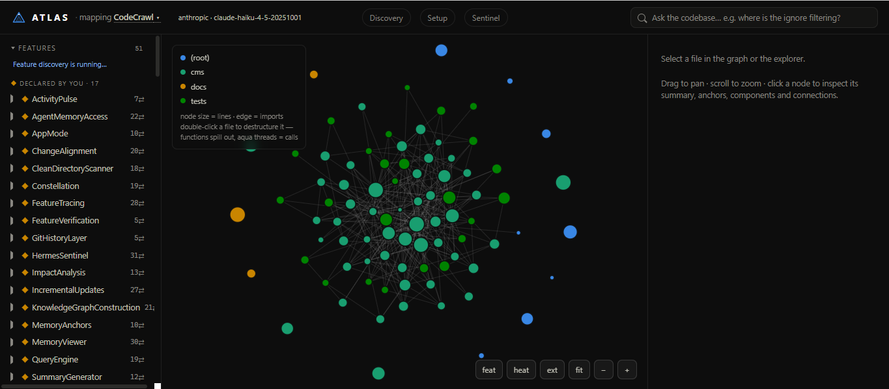
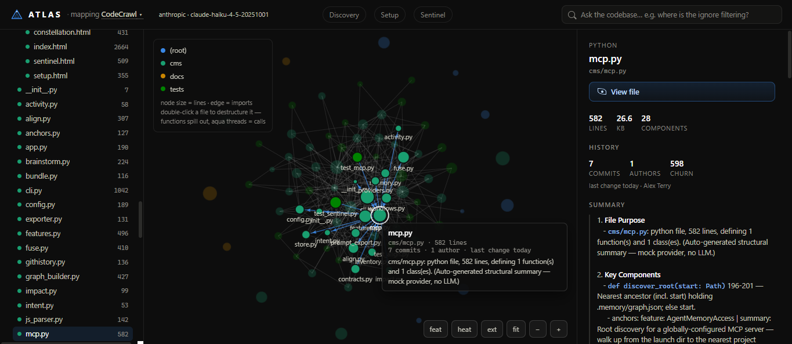
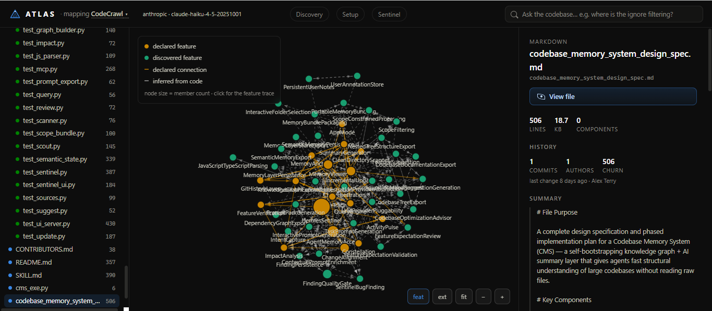
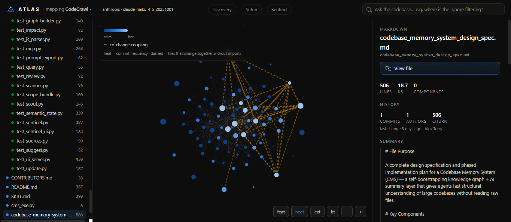
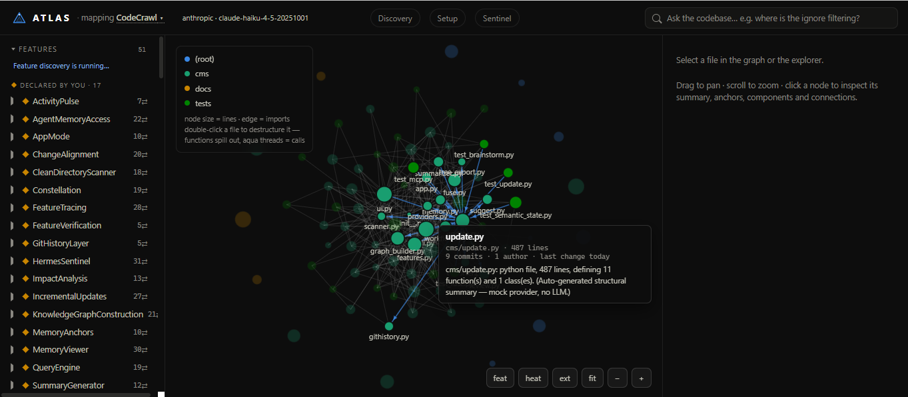
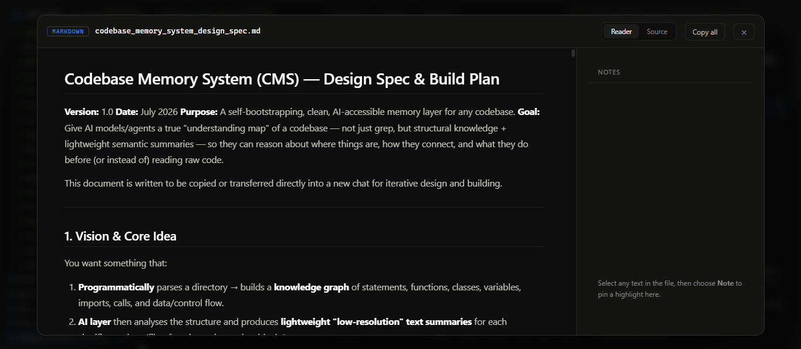
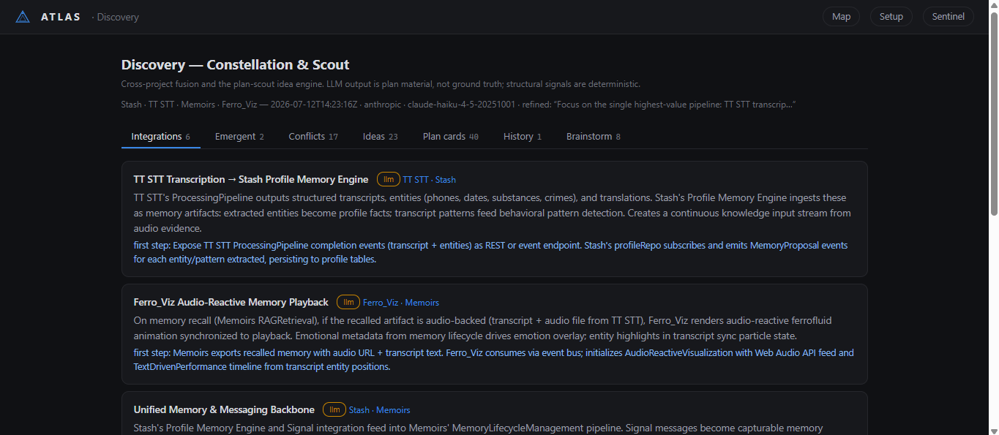
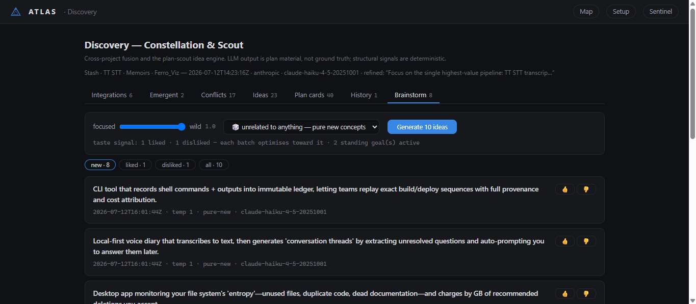
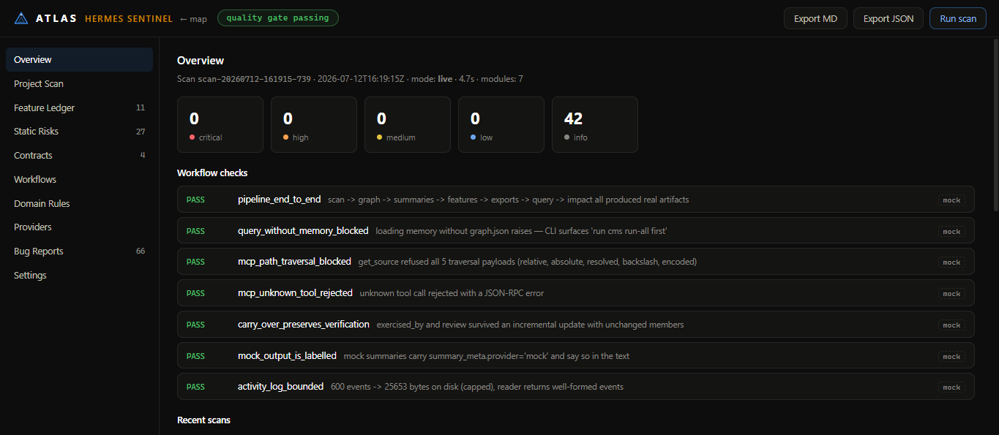
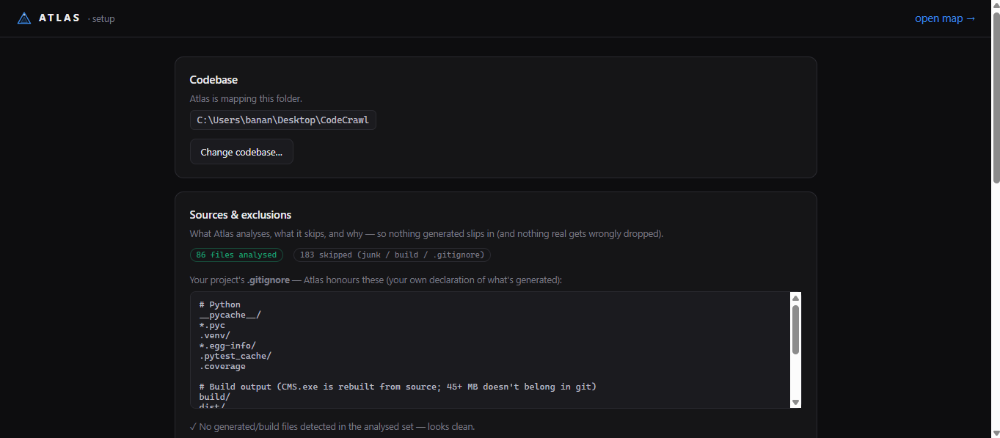

<h1>▲ Atlas</h1>

**Every codebase, mapped. Ground truth for AI agents.**

*(Atlas is the product; `cms` is the command line and Python package — `pip install`, `cms run-all`, `cms mcp`.)*





---

Atlas is a self-bootstrapping structural + semantic memory layer for codebases, built for AI
agents. It scans a project (ignoring junk like `node_modules/`, `__pycache__/`,
build output), parses the source into a knowledge graph of files, classes, and
functions, generates low-resolution AI summaries for each, and exposes a query
interface so an agent can ask *"where is the auth logic?"* and get precise answers —
file paths, line ranges, call connections, and intent summaries — instead of grepping.

Beyond finding things, Atlas **keeps the codebase honest**: it traces features, audits
built-vs-intended alignment, runs a completion quality gate (Hermes Sentinel), and — with
the Change-Alignment loop — answers *"did this change do what it was meant to?"* So agents
consult memory before grep, ground every edit, and prove they finished.

Full design rationale: [`codebase_memory_system_design_spec.md`](codebase_memory_system_design_spec.md).
Project credits and contribution provenance: [`CONTRIBUTORS.md`](CONTRIBUTORS.md).
License: [AGPL-3.0](LICENSE) — free to use and study; ship it (or host it) modified and your changes must be open too.

## Install

```bash
pip install -e .            # core (networkx, pathspec, typer)
pip install -e ".[anthropic]"  # + Anthropic SDK for LLM summaries
```

## Usage

```bash
cms run-all                 # scan -> graph -> summaries -> features -> git -> .memory/
cms query "where is the ignore pattern filtering logic?"
cms ui                      # open the memory viewer in your browser
cms update                  # incremental: only changed files re-summarized
cms watch                   # keep .memory/ in sync as you edit
cms impact cms/scanner.py::scan   # blast radius of a change
cms verify                  # map tests to features via coverage
cms verify CleanDirectoryScanner  # run exactly the tests mapped as exercising a feature
cms mcp                     # MCP server for AI agents (see below)
cms sentinel                # Hermes Sentinel: bug finding + completion quality gate
cms fuse                    # Constellation: cross-project integration/conflict report
cms scout scan ~/Desktop    # hunt plan.md docs, card them, mass-review for ideas/patterns
# Brainstorm (Discovery UI tab): temp-adjusted new-concept generation that
# learns from your likes/dislikes; standing goals via a hidden panel
cms scan                    # just the clean tree (subset of run-all)
cms build-graph             # scan + knowledge graph only
cms summarize               # (re)generate AI summaries only
cms prompt "add rate limiting"    # export a memory-grounded task brief
```

## App mode (`cms app` / CMS.exe)

Everything in motion with one command — or one double-click:

```bash
cms app        # sync memory -> start file watcher -> serve UI -> open browser
cms            # no arguments does the same thing
```

On launch it heals any stale memory (only changed / mock-summarized files are
reprocessed), then watches for edits and keeps `.memory/` current while the UI
runs. Ctrl+C stops everything.

### Running from source (`CMS.bat`)

On machines where an unsigned exe is unwelcome (AV quarantine), `CMS.bat` is
the equivalent launcher: it runs `python -m cms.cli` from the repo's `.venv`
(falling back to the `python` on PATH), passes arguments through, and returns
the real exit code. Double-click for the app, or `CMS.bat query "..."` etc.

### Packaging as CMS.exe

```bash
pip install pyinstaller
python -m PyInstaller --onefile --name CMS --console --clean --noconfirm ^
    --add-data "cms/ui_assets/index.html;cms/ui_assets" --hidden-import anthropic ^
    --exclude-module torch --exclude-module torchvision --exclude-module torchaudio ^
    --exclude-module numpy --exclude-module scipy --exclude-module pandas ^
    --exclude-module matplotlib --exclude-module cv2 --exclude-module PIL ^
    --exclude-module lxml --exclude-module IPython --exclude-module jupyter ^
    --exclude-module pytest --exclude-module coverage --exclude-module rich ^
    --exclude-module pygments --exclude-module tkinter --exclude-module setuptools ^
    cms_exe.py
```

The excludes matter: networkx probes for optional backends (numpy/scipy/pandas/
matplotlib) at import time, so PyInstaller happily bundles whatever heavy
packages live in your site-packages (a torch install alone adds ~400 MB).
CMS uses none of them.

**Installer-style first run:** double-click `CMS.exe` anywhere and it asks which
codebase this copy should work on, then saves the choice to `cms.workspace.json`
next to the exe. Every launch after that goes straight to that project — so you
can keep one copy of CMS.exe per codebase, each linked to its own root. Delete
`cms.workspace.json` (or pass `--root`) to re-link. If the exe sits inside a
project root already, that project is used directly with no prompt.

All CLI commands work through the exe too (`CMS.exe query "..."`,
`CMS.exe impact ...`). The API key is read from `~/.cms/config.json` as usual.
Note: `CMS.exe verify` shells out to your installed Python for pytest/coverage.

## MCP server (`cms mcp`)

Expose the memory to AI agents as native tools — memory consulted before grep:

```bash
claude mcp add cms -- cms mcp        # Claude Code
codex mcp add cms -- cms mcp         # Codex
```

No `--root` needed: the server walks up from its launch directory to the
nearest project holding `.memory/graph.json`, so one global entry serves every
repo. In an un-mapped repo it stays alive and tools answer "no memory layer —
run `cms run-all`".

19 tools (this list is contract-checked against `cms/mcp.py` by Sentinel):

- **Grounding / read** — `query_codebase`, `get_file_summary`, `get_source`,
  `get_feature_trace`, `list_features`, `who_calls`, `who_imports`, `get_impact`.
- **Discuss** — `ask_codebase`: plain-language Q&A over the whole memory
  (flows, features, connections, intent-vs-reality), evidence named. Also in
  the UI as the Ask Atlas chat popup and on the CLI as `cms ask "…"`.
- **Judgment / plan** — `get_review`, `get_suggestions`, `get_sentinel_report`,
  `export_task_prompt`.
- **Alignment loop** — `declare_intent`, `check_alignment`.
- **Session control** — `switch_project` (flip the server to another project
  root mid-session; unmapped targets get the exact build command back).
- **Constellation** — `list_projects`, `get_fusion_report`, `refine_fusion`:
  multi-project discovery — read and conversationally refine the
  cross-codebase fusion report (see `cms fuse`).

Every call is logged to `.memory/activity.jsonl`, and the UI renders live glow
pulses on the touched nodes plus an `MCP · tool` badge — you can watch your
agent think.

## Git history layer

Inside a git repo, `run-all`/`update` enrich file nodes with commits, authors,
churn and age, and detect **hidden coupling**: file pairs that repeatedly change
together without any import relationship (CO_CHANGES edges). In the UI, hit
`heat` — nodes recolor by change frequency (calm→hot), co-change pairs draw as
dashed amber links, and the inspector gains a History section.

## Verification loop

`cms verify` runs your tests under coverage with per-test contexts and maps each
feature to the tests that actually execute its code (`exercised_by` — named
deliberately: coverage proves execution, not behavioural correctness). Then
`cms verify <Feature>` runs exactly those tests, turning the feature trace's
checklist into runnable evidence.

## Feature tracing (`cms trace`)

Features are first-class: declare them with `@memory:feature:Name` anchors (the
LLM also discovers undeclared ones from file summaries). For every feature CMS
computes its members, entry points, and *flows* — call chains walked through the
graph with `file:line` at each step — then writes a trace with Purpose, Flow,
Inputs & Outputs, and a **Verification Checklist** of concrete checks to confirm
the implementation does what you intended.

```bash
cms trace                    # build/refresh all feature traces
cms features                 # list features with member/entry counts
cms trace CleanDirectoryScanner   # print one trace
```

Traces live in `.memory/features/*.md`, in the graph (`feature:` nodes, so
`cms query` finds them), and in the UI — pick a feature in the explorer to see
its flow rail and light up its member files on the graph.

Features connect to each other two ways: **declared** links from `@memory:connects:`
anchors, and **inferred** RELATES edges derived from the code (a member of one
feature imports or calls a member of another) — so even LLM-discovered features
join the web. Hit the `feat` button in the UI (or open `?view=features`) for the
feature-level architecture map: amber nodes are declared features, green are
discovered, solid edges declared, dashed inferred. Click any node for its trace.

## AI review (`cms review`)

The alignment audit: for every feature the AI compares what you *expect* (the
declared intent) against what was actually *built* (traced flows, member
summaries, mapped exercising tests) and hands down a verdict — **aligned / partial /
drift / unverified** — with a one-line plain-English headline, an
expected-vs-built explanation, concrete gaps, and an education note teaching
you how it really works under the hood. Plus an app-level rollup.

```bash
cms review                    # build/refresh the full review
cms review CleanDirectoryScanner   # print one feature's review
```

Results live in `.memory/review.md`, on the graph (agents get them via the
`get_review` MCP tool), and in the UI: hit the `review` button (or `?review=1`)
for the overlay — one line per feature, expand for detail, "zoom into this
feature on the map" for the full evidence.

## Suggestions (`cms suggest`)

CMS plans what's worth building next. It studies its own memory — review
verdicts and gaps, features with no mapped exercising tests, git churn hotspots, hidden
coupling — and proposes suggestions each scored **value (1–5) vs effort (1–5)**,
ranked by **ROI = value/effort**, highest return on investment first.

```bash
cms suggest          # ranked plan -> terminal + .memory/suggestions.md
```

Suggestions also appear in the review overlay ("Suggested next") and are served
to agents via the `get_suggestions` MCP tool — so your AI can pick its own next
task by ROI.

## Memory viewer (`cms ui`)

A local, zero-dependency web UI over the memory layer at `http://127.0.0.1:7717`:

- **Explorer** — clean file tree, junk-free, colored by top-level directory.
- **Knowledge graph** — force-directed canvas; node size = lines, edges = imports.
  Hover for a summary tooltip, click to inspect, drag/pan/zoom, `ext` toggles
  external modules, `fit` reframes.
- **Inspector** — file stats, anchor chips, the AI summary, every component with
  line ranges, caller/callee counts and expandable source snippets, plus
  imports/imported-by navigation.
- **Search** — press `/` and ask in plain language; results rank via the same
  intent engine as `cms query`.
- Deep-link a file with `?file=cms/scanner.py`. Serves on localhost only.

### Screenshots

| | |
|---|---|
|  *Feature map: declared (amber) vs AI-discovered (green) features and their connections* |  *Heat view: churn coloring, dashed amber = files that change together without imports* |
|  *Hover any node for its summary, lines, commits and provenance* |  *Built-in reader: markdown rendering, source view, quote-anchored notes* |
|  *Discovery: cross-project integrations, emergent features and conflicts (Constellation)* |  *Brainstorm: temperature-dialed new concepts that learn from 👍/👎* |
|  *Hermes Sentinel: findings, workflow checks and the completion quality gate* |  *Setup: what gets analysed, what's skipped, and why — with evidence* |

Everything lands in `.memory/` inside the analysed project:

```
.memory/
├── clean_tree.md      # filtered directory tree with per-file metadata
├── clean_tree.json    # machine-readable version
├── graph.json         # knowledge graph, summaries embedded in nodes
├── index.md           # what's here + how to query
└── summaries/         # per-file markdown summaries mirroring the source layout
```

## Python API (for agents)

```python
from cms import CodebaseMemory

mem = CodebaseMemory.load(".memory/graph.json")
for hit in mem.query_intent("clean directory tree building", top_k=5):
    print(hit.path, hit.lines, hit.summary)
    print("called by:", hit.called_by)

mem.who_imports("cms/scanner.py")   # -> ["file:cms/cli.py", ...]
mem.who_calls("scan")               # -> caller node ids
mem.neighbors("file:cms/scanner.py")
```

## API key setup

```bash
cms config set anthropic_api_key sk-ant-...   # stored in ~/.cms/config.json
cms config show                               # settings with secrets masked
```

Environment variables always take precedence over the config file. Other keys:
`provider`, `anthropic_model`, `openai_api_key`, `openai_base_url`, `openai_model`.

## Memory anchors

Guide the memory layer with `# @memory:` comments — developer-curated intent the
AST can't infer. Anchors land on graph nodes, enrich LLM prompts, and get a
ranking boost in queries.

```python
# @memory:feature:UserAuthentication
# @memory:connects:LoginFlow, TokenService
# @memory:summary:Handles JWT issuance and refresh.
def login_user(...):
    ...

# === @memory:module:GraphLayer ===
# Purpose: Maintains the runtime knowledge graph   (plain comments become notes)
class MemoryEngine:
    ...
```

Line-form anchors attach to the next `def`/`class`; `module` tags (and anchors not
followed by a definition) attach to the file. Only real comments count — anchor-like
text inside strings or docstrings is ignored.

## Summary providers

Selected via `--provider` or the `CMS_PROVIDER` env var (`anthropic` | `openai` | `mock`):

- **anthropic** — default when `ANTHROPIC_API_KEY` is set; uses `claude-haiku-4-5`
  (override with `CMS_ANTHROPIC_MODEL`).
- **openai** — any OpenAI-compatible endpoint (Ollama, LM Studio, xAI, OpenAI).
  Configure `CMS_OPENAI_BASE_URL` (default `http://localhost:11434/v1`),
  `CMS_OPENAI_MODEL`, and `CMS_OPENAI_API_KEY`/`OPENAI_API_KEY` if needed.
- **mock** — deterministic structural summaries from AST facts, no network.
  Automatic fallback when no key is configured, so the pipeline always runs.

## Ignore rules

Three layers, in increasing precedence: **built-in defaults** (see `cms/config.py`
— VCS, virtualenvs, `node_modules/`, build output incl. `dist/` and the `dist-*/`
convention, dependency lockfiles, IDE/OS junk), then the project's own
**`.gitignore`** (Atlas honours what *you* already declared as generated — no
guessing), then **`.cmsignore`** (project-specific overrides; gitignore syntax,
and `!pattern` can re-include something the defaults or `.gitignore` excluded).
Only whitelisted source extensions are included (`.py`, `.md`, `.json`, `.ts`,
`.tsx`, ... — see `LANGUAGE_BY_EXTENSION`). Prefer the Setup screen's scope
picker for a per-build selection without editing files.

## File viewer & notes

In the memory viewer (`cms ui` / `cms app`), selecting a file shows a **View file**
button in the inspector. It opens a full-screen reader: markdown renders formatted,
code is syntax-highlighted with line numbers. Select any text to **copy** it or pin a
colour-tagged **note** — highlights and notes persist in `.memory/notes.json` and
reappear when you reopen the file. Deep-link straight to a file with
`/?view=<path>&viewmode=reader|source`.

## Hermes Sentinel (`cms sentinel`)

Built-in bug finding, feature auditing and a completion quality gate. Sentinel
inventories the repo, scans for risky patterns (classified by context, not
blanket-flagged), audits `docs/feature_ledger.json` completion claims against
graph evidence, checks UI↔HTTP↔MCP↔docs contracts, executes end-to-end
workflow checks against the real pipeline (including the carry-over
regression trap), validates CMS domain invariants and the provider layer, and
persists everything as bug reports under `.memory/sentinel/`.

```bash
cms sentinel                # full scan; exits non-zero on active critical findings
cms sentinel findings       # list persistent findings (BUG-… ids)
cms sentinel status BUG-000007 false_positive --reason "pattern registry"
cms sentinel export -f json # report to .memory/sentinel/reports/
```

The viewer serves a full Sentinel screen at `/sentinel` (run scan, inspect
findings, change statuses, export). Gate thresholds live in
`sentinel.config.json`. Full guide: `docs/HERMES_SENTINEL.md`.

## Development

```bash
pip install -e ".[dev]"
pytest tests/
cms run-all   # self-hosting check: CMS analysing its own code
cms sentinel  # quality gate: fails on active critical findings
```

Current scope: **Python** (full AST — classes/functions/imports/calls/inheritance)
and **TypeScript/JavaScript** (`.ts/.tsx/.js/.jsx` via a lightweight parser —
top-level declarations as components, import/require/export-from resolved to
connections, plus best-effort CALLS and `extends` INHERITS edges resolved
through named imports, tagged `provenance: heuristic`); other whitelisted files
get AI summaries but no structural parse.
Query ranking is keyword+structure. Next up: tree-sitter for full-fidelity
multi-language ASTs (calls/inheritance across languages), embedding-based
semantic search.

## License

Atlas is licensed under the **GNU Affero General Public License v3.0**
([LICENSE](LICENSE)). You are free to use, study, modify and share it — but if
you distribute it or run a modified version as a network service, your changes
must be published under the same license.

Copyright © 2026 Alex Terry (mrt150683-lgtm). For commercial licensing outside
the AGPL's terms, open an issue or get in touch.
